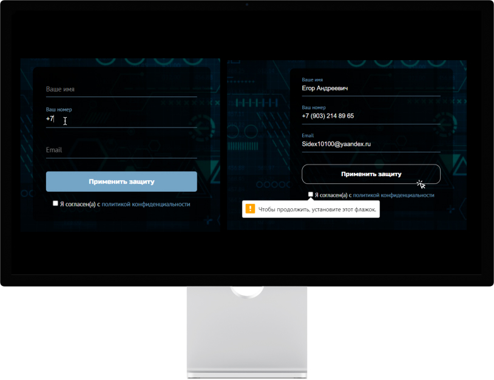

# SIDEX-Landing-Page
### Корпоративный сайт предоставляющий услуги по кибербезопасности IT-организациям.
____
+ Весь UI был реализован мною в Figma при помощи референсов 
+ Вся верстка придерживалась методологии БЭМ
+ Скрипты написаны на чистом JavaScript
+ Сделана адаптация под мобильные устройства
____
### Технологии проекта

:mag_right: [SIDEX](https://hamelons.github.io/SIDEX-Landing-Page/)

