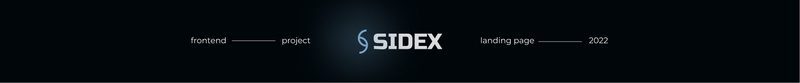
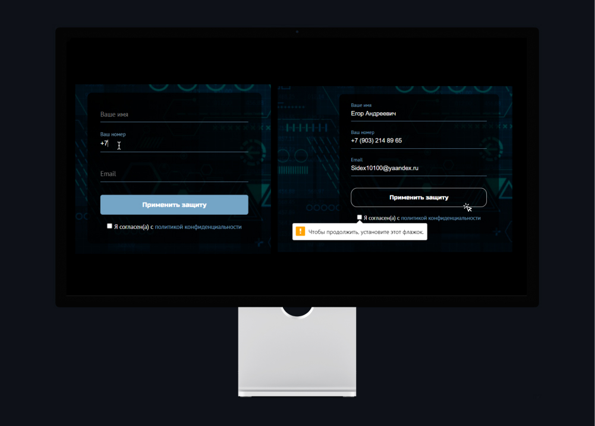

# SIDEX-Landing-Page
#### Корпоративный сайт предоставляющий услуги по кибербезопасности IT-организациям.
____
+ Весь UI был реализован мною в Figma при помощи референсов 
+ Вся верстка придерживалась методологии БЭМ
+ Скрипты написаны на чистом JavaScript
+ Сделана адаптация под мобильные устройства
____
### Технологии проекта

____
## Задача: Показать стабильность
Внедрил состояние загрузки сайта, при помощи нативного прелоадера

___
## Задача: Упростить UX
Для комфортного взаимодействия внедрил button 'Навверх' или Scroll To Top
Дабы юзер не делал ручной скроллинг

___
## Задача: Показать безопасность вводимых персональных данных
Сделана отдельная страница 'Политика конфиденциальности' в которой объясняется юзерам, для каких
целей и объеме будут обрабатываться персональные данные

___
## Задача: Взаимодействие со стороннего API
Завести профиль на vimeo и загрузить отредактированное видео. После же, 
произвести интеграцию для корректного отображения материала в секции сайта

___
## Задача: Валидность формы
1. Реализована маска для телефона формата RU +7 ( ___ ) ___ __ - __ 
2. В инпуте 'Имя' нельзя указывать латинские буквы
3. После корректного ввода, user соглашается на обработку данных кликая на 'chekbox'
4. Все поля ввода - обязательны

___

:mag_right: [SIDEX](https://hamelons.github.io/SIDEX-Landing-Page/)
